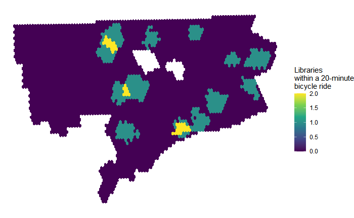

```{r setup, include=FALSE}
knitr::opts_chunk$set(echo = TRUE)
```

# Introduction

This portfolio contains work produced while studying as a `Master of Urban Planning` candidate at the `Harvard Graduate School of Design`.  


This portfolio demonstrates each of the following skills gained through assignments under `VIS 2128: Spatial Analysis`:

* Displaying multiple vector layers on the same map
* Calculating and displaying relationships among point and polygon layers based on distance
* Aggregating point data to a layer of polygons
* Calculating and displaying accessibility, based on travel time
* Converting between raster layers and vector layers
* Displaying raster data on a map
* Georeferencing a raster image
* Displaying data on an interactive map

Unless otherwise noted, all work presented below is my own and was created using publicly-available data sources.

# National-Level Map

## U.S. Same-Sex Households Map
This interactive map demonstrates the following skills: 

* Displaying data on an interactive map

This map shows the spatial distribution of the U.S. population living in either a coupled opposite-sex or same-sex households. “Coupled” for this analysis means living in a household with either a married spouse or an unmarried partner present. All information was collected from the 2019 American Community Survey (ACS 2019) through the Census API at <a href="http://data.census.gov" class="uri">http://data.census.gov</a>.</p>
<p><strong>Interactive Map</strong></p>

[](https://acardelle.github.io/portfolio/fullsize/LGBT_interactive.html){target="_blank"}

# Data Maps of U.S. Cities

## Cambridge Map
This map demonstrates the following skills:

* Displaying multiple vector layers on the same map

This map shows the locations of playgrounds throughout the city of Cambridge, Massachusetts plotted amongst the city's greenspace and divided by neighborhood ward.

[](https://acardelle.github.io/portfolio/fullsize/cambridge_playgrounds.pdf){target="_blank"}

## Detroit Maps

### Accessibility
This map demonstrates the following skills:

* Converting between raster layers and vector layers
* Displaying multiple vector layers on the same map
* Calculating and displaying accessibility, based on travel time
* Displaying raster data on a map

These maps of Detroit, Michigan show the relative distance and accessibility of the city's libraries as reachable by bicycling. Data is from the City of Detroit. 

This first map is an isochrone vector layer showing the number of libraries reacheable within a 20-minute bicycle ride.

[](https://acardelle.github.io/portfolio/fullsize/Alex_3B_big.pdf){target="_blank"}

This next map takes the vector information from the first map and superimposes it over a raster layer showing Detroit's street network. Additionally, by using `r5rcore's` exponential decay travel time calculation, this map shows a relative accessibility 'score' for library access via bicycling.

[](https://acardelle.github.io/portfolio/fullsize/Alex_4B_big.pdf){target="_blank"}

## Boston Map
This map demonstrates the following skills:

* Aggregating point data to a layer of polygons
* Calculating and displaying relationships among point and polygon layers based on distance

This map of Boston, Massachusetts shows the placement of the city's publicly-accessible ev stations in relation to the city's libraries. 

[](https://acardelle.github.io/portfolio/fullsize/Boston_ev_libraries_big.pdf){target="_blank"}

## Philadelphia Map
This map demonstrates the following skills:

* Georeferencing a raster image

This map of Philadelphia, Pennsylvania shows the city's modern day neighborhoods and transit infrastructure superimposed over a GIS-georeferenced map of the city's historic environs around 1779.

[](https://acardelle.github.io/portfolio/fullsize/Philadelphia_big.pdf){target="_blank"}


