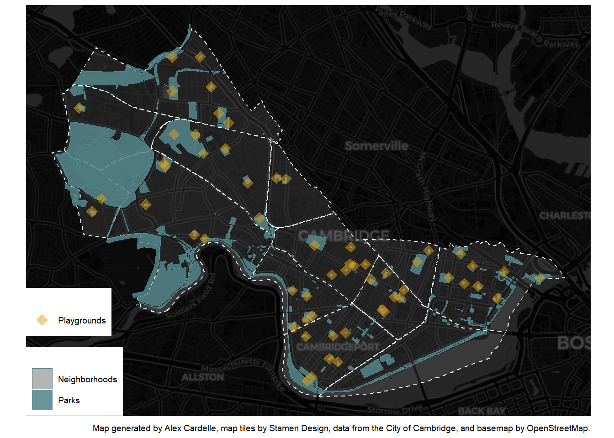
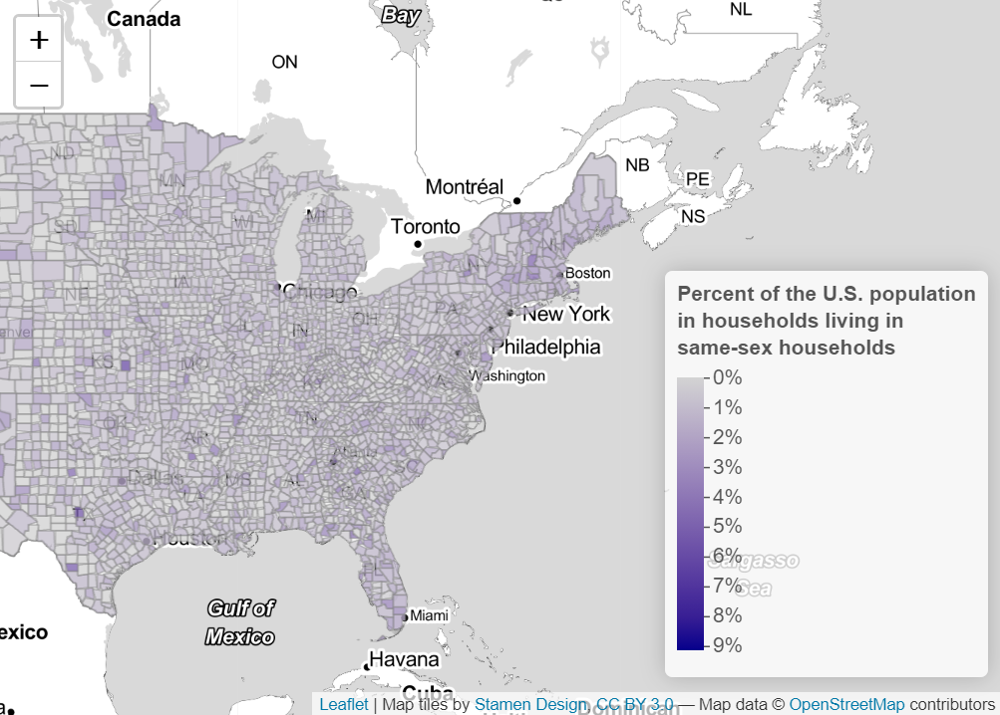
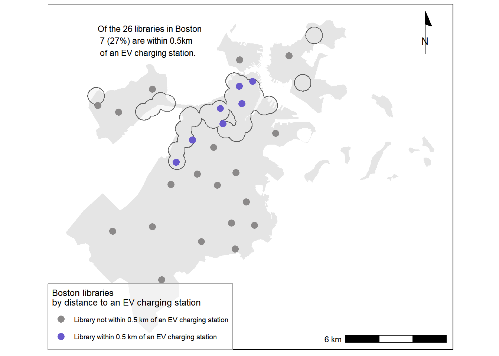
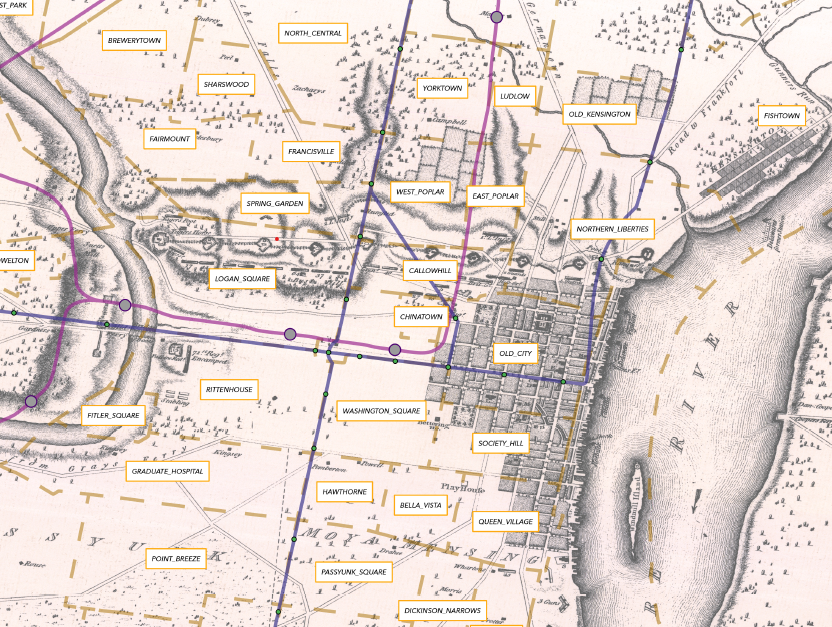
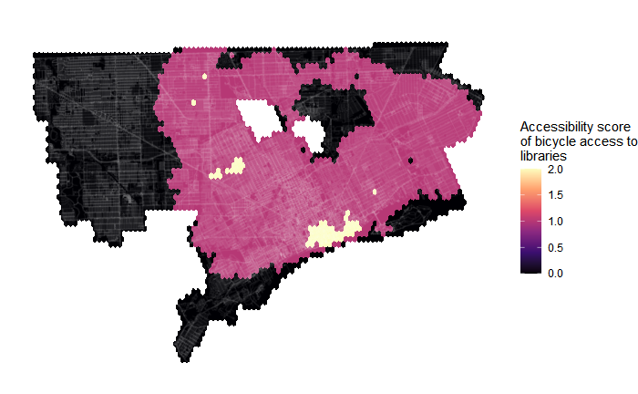

```{r setup, include=FALSE}
knitr::opts_chunk$set(echo = TRUE)
```

# Introduction

This is an example of a portfolio that someone might assemble to demonstrate the skills they have developed in VIS 2128. I have created this page using RMarkdown. There are fancier tools out there for creating and hosting webpages, and you are welcome to use any of those if you like. The advantage of this approach is that you can create your webpage directly from RStudio.

This example uses the `downcute` theme, which is available if you install the `rmdformats` package. The themes in the `rmdformats` have a table of contents that only includes level-one headings.

Other themes in the `rmdformats` package are `material`, `html_clean`, `html_docco`, `readthedown`, and `robobook`.  

Your portfolio should demonstrate each of the following skills (not all of which are demonstrated in this example):

* DONE Displaying multiple vector layers on the same map
* DONE Calculating and displaying relationships among point and polygon layers based on distance
* DONE Aggregating point data to a layer of polygons
* DONE Calculating and displaying accessibility, based on travel time
* Converting between raster layers and vector layers
* DONE Displaying raster data on a map
* DONE Georeferencing a raster image
* DONE Displaying data on an interactive map

## Displaying Multiple Vector Layers

[](https://acardelle.github.io/portfolio/fullsize/cambridge_playgrounds.pdf){target="_blank"}

## Interactive Map
This interactive map demonstrates the following skills: 

* Displaying data on an interactive map

[](https://acardelle.github.io/portfolio/fullsize/LGBT_interactive.html){target="_blank"}

## Boston Map
* Aggregating point data to a layer of polygons

[](https://acardelle.github.io/portfolio/fullsize/Boston_ev_libraries_big.pdf){target="_blank"}

## Philadelphia Map
This map demonstrates the following skills:

* Georeferencing a raster image

[](https://acardelle.github.io/portfolio/fullsize/Philadelphia_big.pdf){target="_blank"}

# Maps of San Luis Obispo
Here are two maps of San Luis Obispo, California. I might include some text here as well.

## Isochrones
This map shows isochrones based on transit travel times to the nearest school. It demonstrates the following skills:

* Displaying multiple vector layers on the same map
* Calculating and displaying accessibility, based on travel time

## Accessibility
This map shows accessibility based on a distance-decay function of the walking time to the nearest transit stop. It demonstrates the following skills:

* Displaying multiple vector layers on the same map
* Calculating and displaying accessibility, based on travel time
* Displaying raster data on a map

[](https://acardelle.github.io/portfolio/fullsize/Alex_4B.pdf){target="_blank"}
